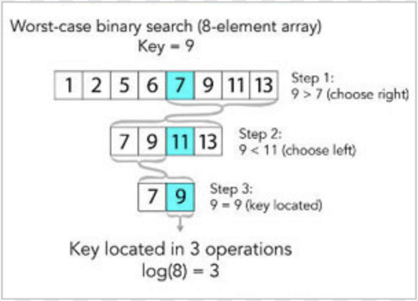

# Binary Search Breakdown

### <ins>Code</ins>
[Binary search Code](BinarySearch.kt)

### <ins>Explanation</ins>
**This algorithm is log2n time**

1) Binary search has 4 key elements to remember:
  - high (last index in the array) `array.size - 1`
  - low (first index in the array) `0`
  - mid (middle of the array) `(high + low)/2` OR `((high - low)/2) + low`
  - guess (element in the array you are guessing) `array[mid]`

2) Binary searches work by finding the middle index of an array and checking if that value is equal to the item we are searching for.
3) If it is equal we return the index.
4) If it is greater than the item we know that all elements to the right of the middle are too high, so we can update our high pointer index to the middle - 1.
5) If it is less than the item we know that all elements to the left of the middle are too high, so we can update our low pointer index to the middle + 1.

### <ins>Visual</ins>

Image from https://www.computerhope.com/jargon/b/binary-search.htm
