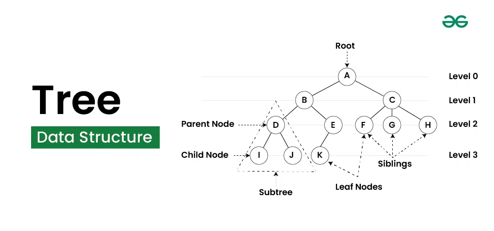

# Trees

### <ins>Explanation</ins>

1) A tree is a special type of graph, all edges go down
2) Think of a simple family tree, this is a good example of a tree data structure

### <ins>Visual</ins>

Image from https://www.geeksforgeeks.org/tree-data-structure/

