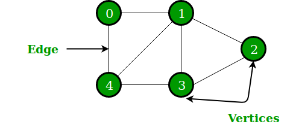
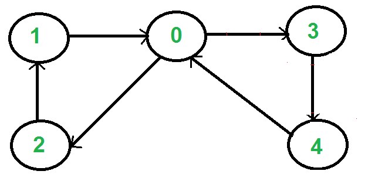

# Undirected Graph

### <ins>Explanation</ins>

1) Contains **Nodes** and **Edges**
2) A node can have many neighbours
3) Practical example is Facebook friends (You can have a friend and that friend will have friends)
4) Another example is Rachel <----> Ross. Rachel dated Ross and Ross dated Rachel

### <ins>Visual</ins>

Image from https://www.geeksforgeeks.org/applications-of-graph-data-structure/

# Directed Graph

### <ins>Explanation</ins>

1) Contains **Nodes** and **Edges**
2) A node can have many neighbours
3) Practical example is transportation systems such as roads, airports, or subway systems can be modeled as directed 
graphs, with vertices representing locations and edges representing connections between them.

### <ins>Visual</ins>

Image from https://www.geeksforgeeks.org/what-is-directed-graph-directed-graph-meaning/

