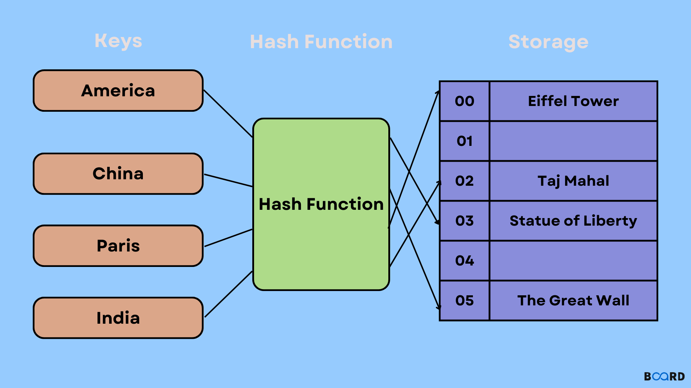
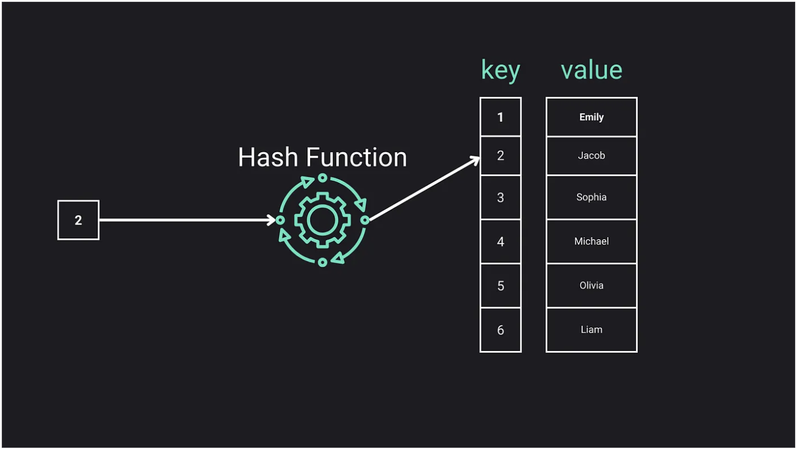

# HashMaps

### <ins>Explanation</ins>

1) Hash maps contain an array and a hash function
2) The hash function takes in a key (usually a string) and assigns it a hash (number)
3) This hash is used to assign the key and value to an index in the hash maps array
4) We can get the associated value from a key in at worst O of n time

### <ins>Visual</ins>

Image from https://www.boardinfinity.com/blog/hashmap/

# Collisions - (Part of hash map stuff)

### <ins>Explanation</ins>

1) A collision is when the hash function assigns the same index for two keys
2) When a collision occurs a linked list is created at that index so if you call that key you will need to then traverse
that linked list to get the value
3) Your hash function should avoid collisions at all costs, as we know linked list data retrival is slow as we must go
through each item in the linked list to get our value
4) Good hash functions will have little collisions

### <ins>Visual</ins>

Image from https://levelup.gitconnected.com/deep-dive-into-hash-maps-building-a-hash-map-with-javascript-8bad2d8be4c0

