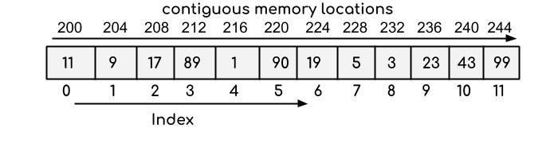

# Array Breakdown

### <ins>Explanation</ins>

1) Arrays are (usually) one type
2) Arrays store their items in memory one after another (refer to diagram)
3) You cannot simply add an item to the end of an array because you cannot be sure that the space next to the last item is free in memory
4) Looking up an item in an array is very fast (fast read time)

### <ins>Visual</ins>

Image from https://beginnersbook.com/2018/10/data-structure-array/