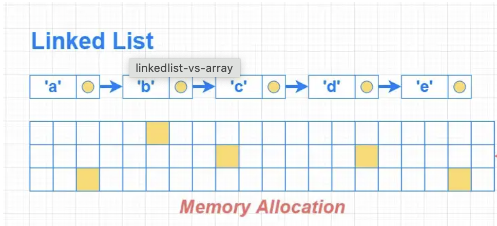

# Linked List Breakdown

### <ins>Explanation</ins>

1) Link lists are (usually) one type
2) Link lists store their items anywhere in memory and each item has a reference to the next 
3) Linked lists allow fast inserts and or deletes, but unlike arrays reads can be slow as you would need to go through each item to get to the one you need.

### <ins>Visual</ins>

Image from https://www.sahinarslan.tech/posts/deep-dive-into-data-structures-using-javascript-linked-list